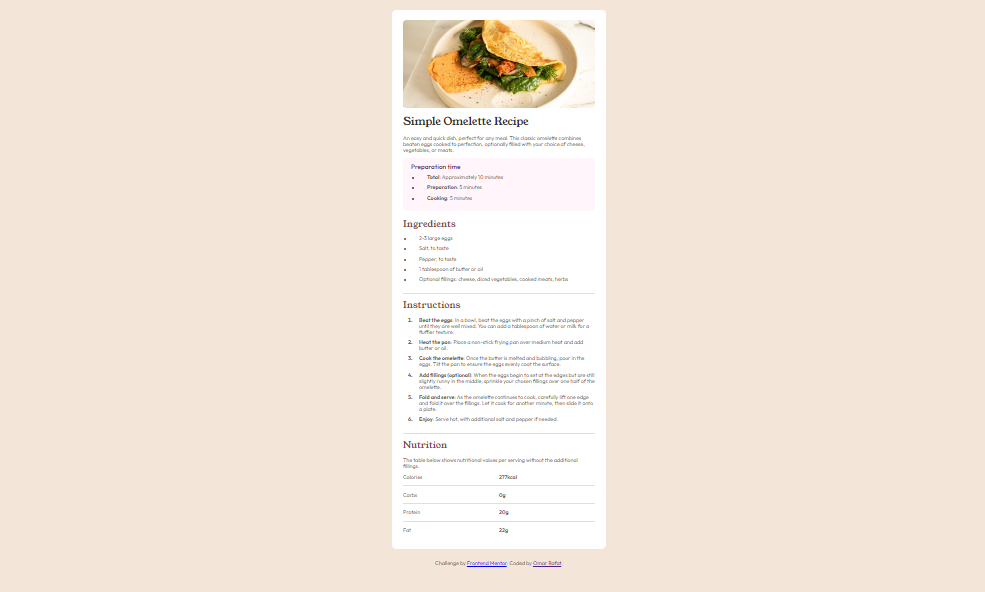

# Frontend Mentor - Recipe Page solution

This is a solution to the [Social links profile challenge on Frontend Mentor](https://www.frontendmentor.io/challenges/social-links-profile-UG32l9m6dQ). Frontend Mentor challenges help you improve your coding skills by building realistic projects.

## Table of contents

- [Frontend Mentor - Recipe Page solution](#frontend-mentor---recipe-page-solution)
  - [Table of contents](#table-of-contents)
  - [Overview](#overview)
    - [The challenge](#the-challenge)
    - [Screenshot](#screenshot)
    - [Links](#links)
  - [My process](#my-process)
    - [Built with](#built-with)
    - [What I learned](#what-i-learned)
    - [Continued development](#continued-development)
  - [Author](#author)

## Overview

### The challenge

Users should be able to:

- See hover and focus states for all interactive elements on the page

### Screenshot



### Links

- Solution URL: [Solution](https://github.com/OmarRafat975/Recipe-page)
- Live Site URL: [Live Site](https://omarrafat975.github.io/Recipe-page/)

## My process

### Built with

- Semantic HTML5 markup
- CSS custom properties
- grid

### What I learned

I learned how to deal tables and how to style them and learned more about grid.

```html
<table>
  <tr>
    <td data-cell="head">Calories</td>
    <td data-cell="value">277kcal</td>
  </tr>
  <tr>
    <td data-cell="head">Carbs</td>
    <td data-cell="value">0g</td>
  </tr>
  <tr>
    <td data-cell="head">Protein</td>
    <td data-cell="value">20g</td>
  </tr>
  <tr class="no-border">
    <td data-cell="head">Fat</td>
    <td data-cell="value">22g</td>
  </tr>
</table>
```

```css
main {
  display: grid;
  place-content: center;
}

table {
  border-collapse: collapse;
  width: 100%;
}

tr {
  display: grid;
  grid-template-columns: repeat(2, 1fr);
  padding: 1rem 0;
  border-bottom: 1px solid var(--gray-color);
}
```

### Continued development

I Want To focas more in CSS because I found it hard to play with ;)

## Author

- Website - [Omar Rafat](https://github.com/OmarRafat975)
- Frontend Mentor - [@OmarRafat975](https://www.frontendmentor.io/profile/OmarRafat975)
